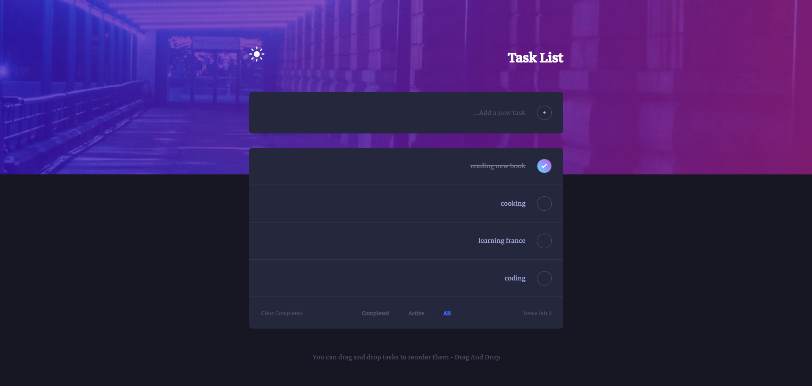

# ToDoApp 📝

A simple and elegant To-Do List web app built with HTML, CSS, and JavaScript.

## 🔹 Features
- Add and delete tasks  
- Mark tasks as completed  
- Filter tasks (All, Active, Completed)  
- Switch between light and dark themes  
- Drag and drop to reorder tasks  
- Responsive design for all screen sizes

## 🔧 Technologies Used
- HTML5  
- CSS3  
- JavaScript (Vanilla JS)

## 🌐 Live Demo

